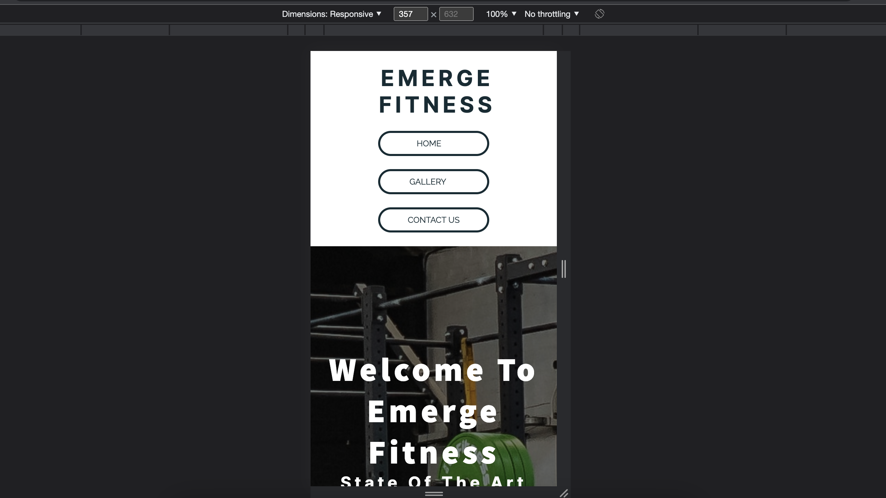
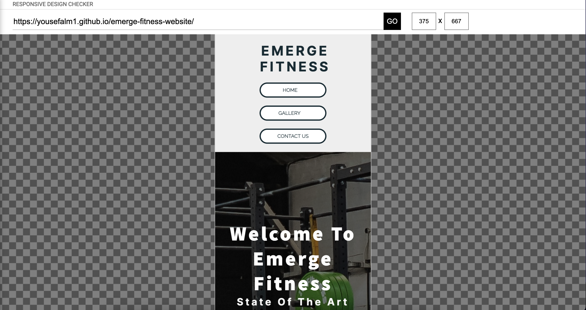

# _Emerge Fitnees_

Emerge Fitness is a website for a gym located in Coventry UK. This website is meant to help clients who visits the site to see what the gym offers, who the coaches are, what our the opening hours, what our mission is and a way for them to contact us if they have any questions.

---

## Technologies used

- HTML
- CSS
- Google Fonts
- Font Awesome Icons

---
## Features

### Home page

### Navigation (Desktop):

- The logo is located in the upper left corner.
- The Home, Gallery, and Contact links are located at the top left corner of the page.
  - Home: Clicking it takes you to the homepage.
  - Gallery: Clicking it will take you there
  - Contact: Clicking on it will take them to a form they may use to get in touch with the business.
- The three navigation links have a border around them, and when you hover over them, the background colour (#1122C34), which is utilised across the page, changes and white text appears.

### Navigation (smaller screens):

- The logo is positioned in the page's centre.
- The three navigation links have been shifted to the page's centre, beneath the logo.
- The border of the navigation links shrinks to meet the reduced dimensions.
- To fit smaller devices, the navigation link gets smaller and closer together.
- The navigation links continue to have a hover effect.

---

### Hero section:

- The background image of the hero section of the website features a portion of the gym. 
- On the background image, there are two different texts that are centred in the middle of the image: - The first text is the main one and says "Welcome to emerge fitness" in bold - the second text is right under the first text but is not bold and reads "State of the are faciltites in the centre of Coventry"
- A button that also leads to the contact page is located directly under the two texts.
- The button's hover effect is the same as that of the navigation links.
- The text, button, and image sizes in the hero section adjust in accordance with the screen's dimensions.

---
### About us section:

- The "About us" phrase appears in the top centre of the first section of the about page.
- The "about us" section has three boxes with grey backgrounds and boroder radii.
- Each of the three boxes holds unique information:
  - The first box offers details about the gym's mission. 
  - Details about the gym's amenities are provided in the second box.
  Information about the gym's operating hours can be found in the third box.
- Each box has a hover feature that modifies the box shadow when it is over it.
- The three boxes are responsive as the dimensions changes.
- On a large screen, the boxes are side by side; as the screen's dimensions decrease, the boxes move to two boxes on top of one box, and additional screen reduction causes the boxes to stack on top of each other.

---

### Meet the coaches:

- The phrase "meet the coaches" is located in the section's top centre.
- There are three coach cards in this area.
- The background of these coach cards is white, while the lettering is black.
- Coach cards come with information on the coaches as well as an image of the coach at the top of the card.
- The coach car also includes a hover effect, which alters the size and changes the background colour (#1122C34), text colour, and background colour to white.
- The three card are resposive when the dimensions of the page changes.
- On a large screen, the boxes are side by side; as the screen's dimensions decrease, the boxes move to two boxes on top of one box, and additional screen reduction causes the boxes to stack on top of each other.

---

### Footer:

- The Emerge Fitness logo can be found in the footer section, centrally located.
- The social media links (Instagram, Twitter, Facebook, and Youtube) are located beneath the logo.
- The social meida links are animated to get bigger when it is hovered over.
- The footer is responsive to when screen dimensions get smaller.

---

### Gallery:

- Same navigation and footer as home page.
- Contains images of clients working out.
- The gallery is repsonsive to all screen dimensions

---

### Contact page:

- The nav bar on this page matches that on the home page.
- This page contains a contact form with the following fields: - First and last names as text inputs - Email address as a text input.
  – A single tel input for the phone number.
  - Three checkboxes on a radio for selecting the reason for contacting.
  - A text box where potential customers can list any additional justifications for contacting.
  - A submit button that, when clicked, turns grey.
- This page responds appropriately to all screen sizes.

--- 

## Testing

- I used Chrome, Safari, and Firefox to test the website.
- I used the dev tools to test to make sure the website is responsive, and I tested every link and button on the site on every browser.
    
    
    

- To check the responsiveness, I also used a website called https://responsivedesignchecker.com/, which was suggested by my mentor.
  - Desktop: 
  - Ipad: 
  - Iphone: 
---

### Bugs

- The bug issue was with the header because I didn't use flex box when I first started writing the code for it but as I continued working on the project, I started using flex box, which causes issues with the responsiveness of the page. As a result, I had to use flex box to rewrite the header's CSS.
- On smaller screens, the footer's logo and address moved to the left. I was able to fix this by using a media query and text align: centre.
- The third issue was that I added background-size to the hero image, which made it appear stretched and unappealing to look at. The solution I used was to remove the background-size, which significantly improved the image's appearance.
- The three navigation links become too large for smaller screens when the dimensions drop below 450px, so the solution was to change the flex-direction from row to column.
- Anyone could change the size of the text area box, so I added resize: none to make it unadjustable.

---

### Validator testing

#### HTML:
- Index.html: No errors or warnings were found when passing through the official W3C validator.

- Gallery.html: No errors or warnings were found when passing through the official W3C validator.

- Contact.html: No errors or warnings were found when passing through the official W3C validator.

#### CSS

- No errors or warnings were found when passing through the official W3C validator.

####  Accessibility and performance

- I used the lighthouse feature in devtools to confirm the website is:
  - Performing well.
  - Accessible
  - Font and colors are readable.

#### Lighthouse (desktop):

#### Lighthouse (mobile):

---

### Deployment

- The website was deployed on GitHub pages the link is is #

---

### credits

- ### Content
   - To better understand box shadow, I used MDN (https://developer.mozilla.org/en-US/docs/Web/CSS/box-shadow). 

  - In order to create the cards, I watched a YouTube video (https://www.youtube.com/watch?v=qXRYMdvq_Dc), which helped me understand the concept of how cards work and allowed me to make adjustments to fit the theme of my website.

  - To assist with transition, I used W3C (https://www.w3schools.com/css/css3_transitions.asp).

  - I modified some of the code from the love running project and used it in the gallery.

  - In order to create the cards, I watched a YouTube video (https://www.youtube.com/watch?v=qXRYMdvq_Dc), which helped me understand the concept of how cards work and allowed me to make adjustments to fit the theme of my website.

- ### Media
   - All the imgage used in this website was taken from https://www.pexels.com/.

### Wire Frames

#### Home Page desktop:

#### Home Page Mobile:

---

#### Gallery Page Desktop:

#### Gallery Page Mobile:

---

#### Contact Page Desktop:

#### Contact Page Mobile:

---